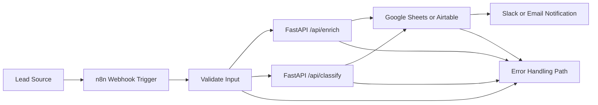

# Architecture

## High-Level Diagram

## Flow Explanation

The workflow starts when n8n receives a lead through a webhook. n8n validates the required fields, sends the lead company data to `/api/enrich`, sends the message to `/api/classify`, stores the combined result in Google Sheets or Airtable, and sends a team notification.

FastAPI owns enrichment and classification logic so n8n remains an orchestrator rather than the place where business rules live.

## Scalability

- n8n should orchestrate the workflow and avoid heavy processing.
- For high-volume lead processing, place Redis or RabbitMQ between n8n and backend workers.
- Use Celery workers for enrichment, classification, storage, and notification jobs.
- Horizontally scale FastAPI instances behind a load balancer.
- Horizontally scale Celery workers independently based on queue depth.
- For 1000+ leads/hour, keep API calls lightweight, add request timeouts, and batch storage writes where possible.

## Reliability

- Configure retries for temporary API, storage, or notification failures.
- Use fallback enrichment values when company details are unknown.
- Send failed jobs to a dead-letter queue after retry limits are reached.
- Keep execution logs in n8n and backend application logs for auditability.
- Add rate limiting to protect backend APIs and downstream tools.
- Store every processing attempt with status and timestamps for debugging.

## Worker Isolation Strategy

Each worker type should own one responsibility: enrichment, classification, persistence, or notification. This prevents slow downstream systems from blocking other lead-processing steps and makes it easier to scale only the overloaded part of the workflow.

## Idempotency Strategy

Use the lead email as the unique key. Storage nodes should update an existing lead row when the same email appears again instead of inserting duplicates. In a production database, enforce a unique index on email and store processing status per lead.
